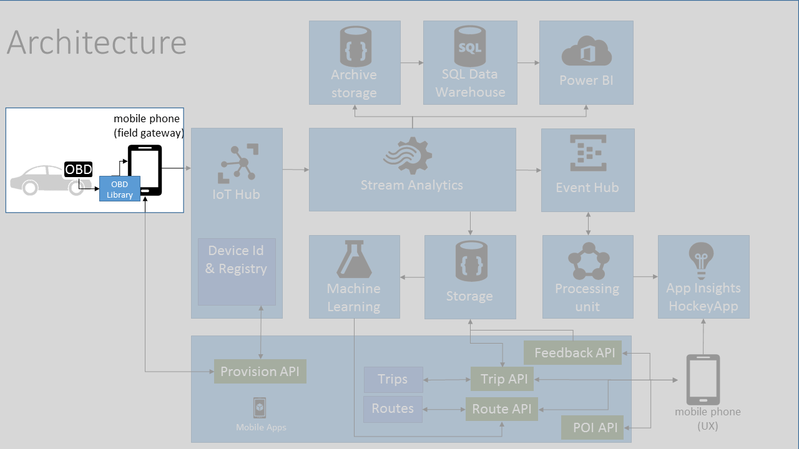
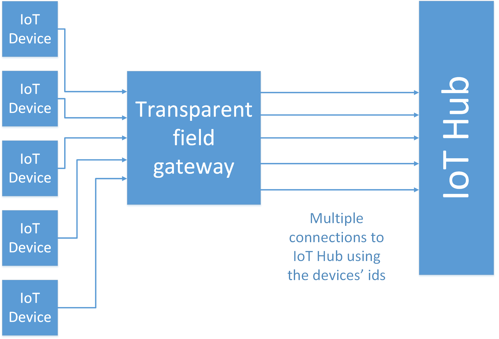
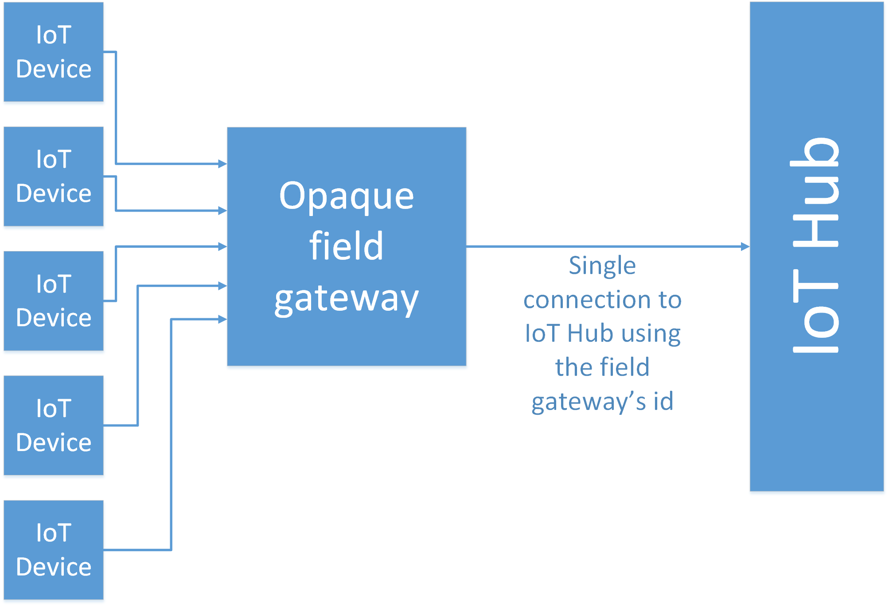

# IoT devices



This section describes how the [TODO:appname] uses a device to collect data from your car and to deliver that data to the solution back end for analysis and processing. This is the starting point for the flow of data through the whole [TODO:appname] system.

You'll learn about the roles of the IoT device and field gateway in the architecture and see how we implemented this functionality in the [TODO:appname] solution.

In this section:

- Primer on IoT devices and field gateways
- IoT devices used in [TODO:appname]
- The field gateway used in [TODO:appname]
- How data gets from a device to the back end

## Primer

### What is an IoT device?

An IoT device is a physical device that collects data from one or more sensors and shares that data with a cloud-based service. For example, a simple device might use a temperature sensor to collect the temperature in the environment and send the temperature value every second to a cloud-based monitoring system. In *command-and-control* scenarios, IoT devices can also receive and act upon commands sent from a cloud-based service. For example, a cloud-based monitoring system might send a command to a device telling it to open a valve.

Example scenarios where IoT devices may be used include:

- Trip tracking and car health
- Sports and fitness tracking
- Health monitoring
- Person or pet or livestock tracking
- Smart appliances
- Home automation and security monitoring
- Beacons or proximity sensors
- Smart vending machines
- Environmental monitoring such as street-level pollution sensors
- Asset tracking
- Industrial automation controllers
- Industrial equipment monitoring for predictive maintenance
- Manufacturing process monitoring devices

As you can see from the previous list, there are a variety of IoT scenarios where you need devices to collect and share data, and sometimes act on commands sent from a service. Despite the variety of scenarios, IoT devices typically share some of the following characteristics:

| Device characteristic | Example |
| ----------------------| ------- |
| Often embedded systems with no human operator. | A smart vending machine tracks stock levels and automatically requests refills. |
| Typically a special-purpose device | Unlike a phone or a tablet, and IoT device usually has a specific function, such as reporting the temperature in the environment. |
| Can be in remote locations where physical access is very expensive. | A sensor attached to a pipe in a remote oil pumping installation. |
| May only be reachable through the solution back end. | An aircraft engine monitoring device may only be reachable from the monitoring service. |
| May have limited power and processing resources. | A health monitoring band worn on the wrist. |
| May have intermittent, slow, or expensive network connectivity. | An device in a car has no network access when there is no cellular coverage or when the car is in a tunnel. |
| May need to use proprietary, custom, or industry-specific application protocols. | Cars typically expose on-board diagnostics using the OBD-II protocol. Industrial automation controllers may use protocols such as DeviceNet, PROFIBUS-DP, or CAN. |
| Can be created using a large set of popular hardware and software platforms. | Examples include Raspberry Pi, Arduino, or Beaglebone devices. |
| May only send data or may also receive data from a service (typically in the cloud). | A car on-board diagnostics system only sends telemetry to the back end system, whereas a home automation system reports information about the home as well as enabling you to control lights and temperature remotely. |
| May send or receive sensitive data that requires a secure communication channel. | A person tracking system for children should only allow parents or other designated individuals access to information about a child's location. |

### What is a field gateway?

Many IoT solutions include a *field gateway* device that sits between your IoT devices and the service they communicate with. A field gateway is typically located close to your devices. Field gateways are often used to enable connectivity and protocol translation for devices that either cannot or should not connect directly to the internet. An example of a device that cannot connect to the internet is one that only supports the Bluetooth communication protocol. An example of a device that should not connect to the internet is one that is unable to use a secure protocol when it connects to the cloud-based service over a public network.

A field gateway differs from a simple traffic routing device (such as a network address translation (NAT) device or firewall) because it typically performs an active role in managing access and information flow in your solution. For example, a field gateway may:

- Manage local devices. For example, a field gateway could perform event rule processing and send commands to devices in response to specific telemetry data.
- Filter or aggregate telemetry data before it forwards it to the service. This can reduce the amount of data that is sent to the service and potentially reduce costs in your solution.
- Help to provision devices.
- Transform telemetry data to facilitate processing in your solution back end.
- Perform protocol translation to enable devices to communicate with your service when your devices do not use the transport protocols that your back-end service supports.

We often characterize field gateways as being *transparent* or *opaque*. A transparent gateway forwards messages to the back-end service leaving the original device id intact, so the service is aware of all the connected IoT devices. An opaque gateway forwards data to the back-end service using its own id, so the service is only aware of the field gateway as a connected device.




> Note: While you typically deploy a field gateway that is local to your devices, in some scenarios, you might deploy a protocol translation gateway in the cloud.

## Devices in our solution: OBD

The [TODO:appname] solution uses On-board Diagnostics (OBD) data from your car to [TODO:expand this]. A device in your car collects the data and sends it to the solution back end for analysis. Modern cars have a standard OBD-II Data Link Connector somewhere in the cabin that enables you plug in an OBD-II compliant dongle that can read the OBD data generated by the car and make it available to other local devices over a USB or Bluetooth connection, or over a local WiFi network.

### What is OBD and does it do?

Depending on the make, model, and age of your car, you can collect various types of data through the OBD connector:

- Additional diagnostic data associated with the "Check Engine Light" indicator on the dashboard that can help to identify the specific component that has malfunctioned.
- Performance telemetry such as speed, fuel efficiency, and engine RPM.

> Note: In addition to retrieving potentially sensitive and personally identifiable information from the car, an OBD dongle plugged into the OBD-II Data Link Connector can also make changes to the firmware in the car [TODO:what more should we say here?]. You should be aware of this when you create any solution that accesses a car through the OBD-II connector and ensure that application takes appropriate steps to prevent any unauthorized access to the OBD connection.

You can find out more about OBD and related standards from [The OBD II Home Page][lnk-obd-homepage] or [On-board diagnostics][lnk-obd-wikipedia] on Wikipedia.

Car manufacturers do not make the same types of data available over OBD-II. The [TODO:appname] makes use of the following common OBD data types collected from a car:

- Speed
- Barometric pressure
- RPM
- Outside temperature
- Inside temperature
- Engine fuel rate

### What devices did we use and why?

During the development of the [TODO:appname] we used several different OBD-II dongles to collect data from cars. Most OBD dongles cannot connect directly to a cloud-based back end, therefore they must connect to local field gateway that can forward the telemetry data on to IoT Hub. The following table lists the dongles we used and why. However there are many more dongles to choose from, with a range of features and prices, that comply with the OBD-II standards.

| Device | Notes |
| ------ | ----- |
| [Bluetooth OBD dongle][lnk-bluetooth-dongle] for Android | Android phones can only connect to a single IP network at any given time. Therefore, if the phone connects to the OBD dongle over WiFi, it cannot simultaneously connect to the cloud-based back-end using the cellular data connection. For this reason, we use a Bluetooth dongle when we use an Android phone. |
| [Wi-fi OBD dongle for iOS][lnk-wifi-dongle] | iOS certification requirements mean that many Bluetooth dongles cannot be used with iOS devices. For this reason, we use a WiFi dongle when we use an iOS phone. |
| [OBD emulator][lnk-obd-emulator] | During the development process, we found it convenient to work with an emulator that generates OBD data. This enabled us to develop and debug the code at our desks rather than sitting in a car. |

## The field gateway in our solution

Most OBD dongles cannot connect directly to a cloud-hosted service, but can make a local network connection over Bluetooth or WiFi, or a physical connection using a USB cable. To send the data collected by the OBD dongle to the cloud, you need a device that acts as a field gateway.

### Decision point: why we use a phone as the field gateway

Many drivers carry a smart phone with them that can connect to an IoT Hub endpoint in the cloud over a public cellular network. Most smart phones can also make ad-hoc local connections using Bluetooth or WiFi. By installing an app on the phone, a driver can easily and cheaply make the smart phone operate as field gateway. Note that in the [TODO:appname] solution, the phone acts as an opaque gateway because

In the [TODO:appname] solution, the phone is not acting just a protocol converter that translates the OBD data received over a local WiFi or Bluetooth connection into a message that is sent to IoT Hub using the AMQPS [TODO:check this is the protocol in use] protocol. The phone also collects data, such as GPS coordinates, that it merges with the OBD data before sending it to the cloud.

The OBD interface in the car provides read-only data (unless you are a mechanic in a garage resetting a warning light after making a repair), which limits the scope for extending the solution to include command-and-control scenarios where the back end sends a command to the IoT device that instructs it to perform an action. However, the phone could respond to a command from the back end to implement command-and-control scenarios. For example, if the data sent from the OBD device indicates that the car is braking sharply, the back end could recognize this and instruct the phone to activate a dash-cam to record what is happening.

### Other ways to connect your OBD dongle to the internet

The current solution uses a mobile phone as the field gateway. The phone acts as protocol translator to convert the OBD-II data sent to the phone by the OBD device over Bluetooth or WiFi into AMQP [TODO - check this is protocol that is used] messages to forward to IoT Hub.

It is possible to connect some OBD devices directly to the internet rather than relying on the phone for connectivity. For example, the [Freematics ONE][lnk-freematics-one] OBD device has an xBee socket for connecting wireless communications modules such as GSM or WiFi. This particular device can also connect to a GPS receiver and has various on-board sensors such as a gyroscope and accelerometer which enable you to capture a richer set of data.

This device is compatible with an Arduino UNO enabling you to program the device directly and to customize the OBD and sensor data it sends to IoT Hub.

## How does data get from a device to the solution back end?

Data from the OBD dongle is sent to the phone (acting in its role as a field gateway) and then combined with additional data collected by the phone before the phone sends the data to the back end through an IoT Hub endpoint. Therefore there are two stages to consider: OBD dongle to phone, and phone to IoT Hub.

### How does the OBD device communicate with the field gateway?

The [TODO:appname] app solution uses an OBD library that abstracts the underlying connection to the OBD dongle. You can find the platform-specific libraries (**ObdLibAndroid** and **ObdLibiOS**) in the Utilities folder in the in the **MyTrips** solution [TODO:make sure this is the correct solution name]. The Android library makes a Bluetooth connection to the OBD dongle, and the iOS library uses a WiFi connection.

The main app makes calls to these libraries through the **OBDDevice** class in the **MyTrips.Shared** project. This class exposes the following three methods to enable the app to communicate with the OBD dongle:

- **Initialize** sets up the connection to the dongle and creates a polling loop that loads the current OBD data from the car into a **Dictionary** every 100 milliseconds.
- **ReadData** enables you to retrieve the current OBD data from the **Dictionary**.
- **Disconnect** shuts down the polling loop and disconnects from the OBD dongle.

### Device requirements for working with IoT Hub

In this sample, the mobile phone in the car, acting as a field gateway, shares the data from the OBD with the back-end service by sending the data to an IoT Hub endpoint hosted in Azure. The next chapter describes the IoT Hub service and its role in this solution. For now, you can think of IoT Hub as the entry point for data from your devices into the cloud-based solution back end.

To communicate with IoT Hub directly, an IoT device or field gateway must use one of the secure protocols supported by IoT Hub:

| Protocol | Port(s) |
| -------- | ------- |
| HTTPS    | 443     |
| AMQPS     | 5671    |
| AMQPS over WebSockets | 443    |
| MQTT | 8883 |

> Note: These are all secure protocols that encrypt the data the device exchanges with IoT Hub. If your IoT device cannot use one of these protocols, you must use a protocol translation gateway.

### Decision point: which protocol do we use to communicate with IoT Hub?

There are five key considerations in the choice of protocol for the device connecting to IoT Hub. Only the first three are relevant in this solution, and led us to choose the AMQPS protocol [TODO - check this, this is my assumption].

- **Library support**. The [Microsoft Azure IoT SDKs][lnk-iot-sdks-repo] GitHub repository contains C, .NET, Java, and Node.js libraries to enable devices to connect to IoT Hub and to send and receive data. Not all libraries support all protocols. For example, the [.NET library does not support AMQPS for Universal Windows Platform (UWP) clients][lnk-uwp-amqp].

- **Cloud-to-device pattern**. HTTP does not have an efficient way to implement server push. As such, when using HTTP, devices must poll IoT Hub for cloud-to-device messages. This is very inefficient for both the device and IoT Hub and introduces latency in command delivery to a device. Although the current solution does not send commands to the device, a possible extension is to send a command to switch on a dash-cam if the back end detects sudden breaking. To minimize latency in delivering commands, you should use the AMQPS or MQTT protocol.

- **Payload size**. AMQPS and MQTT are binary protocols, which are significantly more compact than HTTP. Using AMQPS or MQTT will help to minimize any charges that arise from the phone's cellular data connection to IoT Hub.

- **Field gateways**. When using HTTP or MQTT, you cannot connect multiple devices (each with its own per-device credentials) using the same TLS connection. It follows that these protocols are suboptimal when implementing a field gateway because they require one TLS connection between the field gateway and IoT Hub for each device connected to the gateway. However, in the current solution there is only one OBD dongle per phone, so there will be only one TLS connection to IoT Hub.

- **Low resource devices**. The MQTT and HTTP libraries have a smaller footprint than the AMQP libraries. As such, if the device has few resources (for example, less than 1Mb RAM), these protocols might be the only protocol implementation available. However, modern smart phones typically have sufficient RAM to use the AMQPS protocol.

- **Network traversal**. MQTT uses port 8883. This could cause problems in networks that are closed to non-HTTP protocols. You can use both HTTPS and AMQPS over WebSockets in this scenario. However, this is unlikely to be an issue over the public data network used by the smart phone.

### How does the phone send data to IoT Hub?

The phone uses the .NET libraries from the [Microsoft Azure IoT SDKs][lnk-iot-sdks-repo] GitHub repository [TODO: say whether we are using NuGet or a customized version] to handle the communication with IoT Hub. You can find the code that makes the connection to IoT Hub and sends data using this library in the **IOTHub** class in the **MyTrips.Shared** project:

```
using Microsoft.Azure.Devices.Client;
...

namespace MyTrips.Shared
{
    public class IOTHub : IHubIOT
    {
        private DeviceClient deviceClient;

        public void Initialize(string connectionStr)
        {
            this.deviceClient = DeviceClient.CreateFromConnectionString(connectionStr);
        }

        public async Task SendEvents(IEnumerable<String> blobs)
        {
            List<Microsoft.Azure.Devices.Client.Message> messages = blobs.Select(b => new Microsoft.Azure.Devices.Client.Message(System.Text.Encoding.ASCII.GetBytes(b))).ToList();
            await this.deviceClient.SendEventBatchAsync(messages);
        }
    }
}
```

The **CreateFromConnectionString** method uses a connection string to authenticate with IoT Hub. The section *How do I provsion devices?* in the next chapter provides more information about this connection string.

The **SendEventBatchAsync** method sends multiple **Microsoft.Azure.Devices.Client.Message** messages to IoT Hub. These messages contain OBD and GPS data encoded as JSON.

For more information about sending messages to IoT Hub, see [Messaging][lnk-iothubmessaging] in the Azure IoT Hub developer guide.

> NOTE: The maximum size of the batch of messages sent is 256 KB. See [IoT Hub limits][lnk-hub-limits].

The **OBDDataProcessor** class in the **MyTrips (Portable)** project includes the following methods:

- **ReadOBDData** to retrieve the current OBD data from the OBD dongle.
- **AddTripDataPointToBuffer** to store trip data in a local store on the phone. A trip consists of a collection of data points recorded at set intervals, each of which includes GPS coordinates and OBD data. See below for a complete description of the **Trip** data structure [TODO: this may go into the reference section rather than this chapter].
- **PushTripDataToIOTHub** to send trip data to IoT Hub using the **SendEvents** method shown previously and to remove the trip data from the local store after it has been sent to IoT Hub.

The **CurrentTripViewModel** class in the **MyTrips (Portable)** project coordinates calling the **ReadOBDData**, **AddTripDataPointToBuffer**, and **PushTripDataToIOTHub** methods in response to events such as a user starting or stopping a trip, or the **Geolocator_PositionChanged** event firing.


[lnk-obd-homepage]: http://www.obdii.com/
[lnk-obd-wikipedia]: https://en.wikipedia.org/wiki/On-board_diagnostics
[lnk-bluetooth-dongle]: http://www.amazon.com/gp/product/B005NLQAHS
[lnk-wifi-dongle]: http://www.amazon.com/gp/product/B00OCYXTYY
[lnk-obd-emulator]: http://freematics.com/pages/products/freematics-obd-emulator-mk2/
[lnk-iot-sdks-repo]: https://github.com/Azure/azure-iot-sdks
[lnk-uwp-amqp]: https://github.com/Azure/azure-iot-sdks/blob/master/doc/faq.md#notimpluwp
[lnk-hub-limits]: https://azure.microsoft.com/documentation/articles/azure-subscription-service-limits/#iot-hub-limits
[lnk-iothubmessaging]: https://azure.microsoft.com/documentation/articles/iot-hub-devguide/#messaging