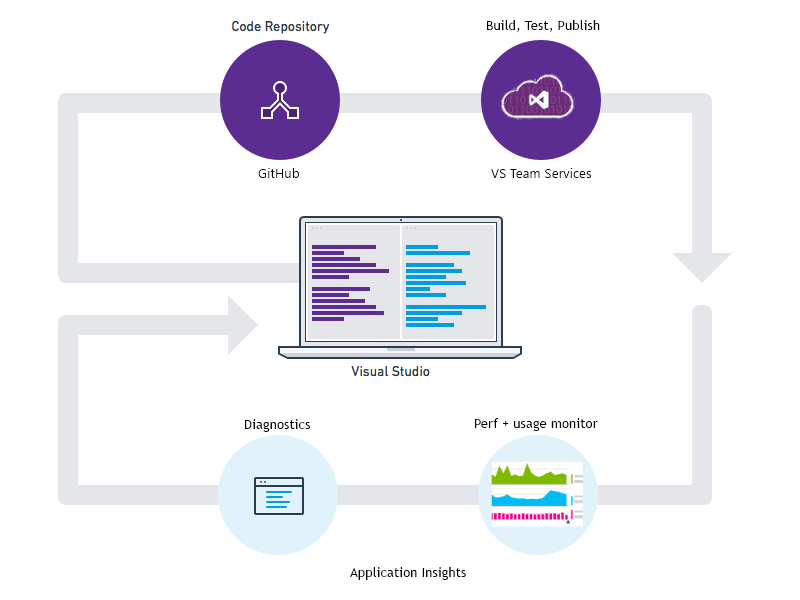

# Primer: Build, release and analytics

## DevOps cycle

We operate a rapid [DevOps](https://en.wikipedia.org/wiki/DevOps) cycle: we build and distribute the app; get feedback about how it performs and what users do with it; and then use that knowledge to feed in to further development cycles. To monitor usage and performance, we get telemetry from the client and server components of the application, as well as feedback from the users themselves. 

Some releases have restricted distribution to designated testers. We also organise 'flighting' (tests of new features with restricted audiences), and A|B testing (parallel tests of alternative UX).

Managing distributions and integrating monitoring over multiple client and server components isn't a trivial task. This process is an essential part of the architecture of the application: we couldn't create a good app of this kind without an iterative development cycle and good monitoring tools. 

So in this section, we'd like to share with you how we manage our devOps cycle.

## Developer Analytics toolkit

This is the set of tools we use. They work well as an integrated kit, but they can also be used separately, or replaced by your favorite alternatives.

* GitHub - code repository
 * An alternative would be VS Team Services source control. It's a more centralized solution that can run either in the cloud or on-premises.
* Visual Studio with Xamarin - IDE
 * Alternative IDEs would be Xamarin Studio, Android Studio, XCode, Eclipse. All of these work well with GitHub and VS Team Services.
 * Visual Studio can run as a front end to GitHub, VS Team Services task management, build and test services.
* VS Team Services - cloud-based build, test and deploy service
* HockeyApp - test management, crash reporting and usage analytics
*  Application Insights - detailed analytics

Here we'll focus on the build, distribution and feedback/analytics side of the cycle.

BTW, these tools are all free for the basic versions.

### Build, distribution and feedback - device software

The mobile app can run on several devices. 

Every code commit can trigger a build, and deploy the app to test users. Crash data and user feedback with screenshots are directly collected when running the app, and fed back into work items for the next cycle. Usage telemetry is also collected.

* **Code:** We develop with Visual Studio, and use GitHub for version control. You can use Visual Studio as a front end to manage builds and version control.
* **Build:** A code change in the GitHub repo triggers a compile and **test**, which runs in the cloud (or can run on-premises). The [continuous integration in VS Team Services](https://www.visualstudio.com/features/continuous-integration-vs) can handle code for all the major device platforms, languages, and unit test frameworks.
* **Distribution:** Build output for client devices is pushed to a HockeyApp private app gallery, from where testers can get and update the mobile app. Update notifications are handled automatically.
* **Feedback:** Once the client app is installed on a test user’s device, [HockeySDK](http://hockeyapp.net/blog/2015/11/18/introducing-mobile-devops.html) collects usage data, **crash reports**, and user feedback with screenshots. Usage data includes counts of daily and monthly active users, new users, sessions, and crash impacted users.
* It creates work items/issues for each new crash group.

### Build, deployment and monitoring - server app

The web backend for the mobile app is an ASP.NET 4.5.1 application in C#.

* **Code:** Developed with Visual Studio 2015, with code stored on GitHub. Visual Studio is used to control commit, build and publish, with local and remote debugging. 
* **Build, test and publish:** [Continuous delivery in VS Team Services](https://azure.microsoft.com/documentation/articles/cloud-services-continuous-delivery-use-vso/) triggers republication on a successful build and test.
* **Backend host:** [Azure Mobile App Service](https://azure.microsoft.com/documentation/articles/app-service-mobile-value-prop/) provides the infrastructure for web hosting, push notifications, and authentication.
* **Analytics:** [Application Insights](https://azure.microsoft.com/documentation/articles/app-insights-overview/) monitors the performance and usage of the live application, and provides powerful diagnostic facilities for any issues that arise.

## Device app distribution and feedback

Our most effective testing is done in the field. The first test of a new feature is on our development devices; but the real hammering comes from putting the feature to real use. Therefore we release any new feature to a small number of friendly testers first; and then a larger group; and then release to the world. At each stage, we take feedback and update our designs and priorities accordingly.

HockeyApp manages these parts of the cycle: managing testing on growing sets of test devices, and feedback. Feedback comes in two kinds: words from the users themselves, augmented with screenshots; and automated reports of crashes and usage counts.

To use HockeyApp, you install its SDK in your code, and connect VS Team Service to your HockeyApp account.

### Distribution

Visual Studio Team Service build automatically pushes the results of release builds to HockeyApp.  

In the HockeyApp dashboard, you choose a group of testers and send invitations to them to download and test your app.

HockeyApp can be configured so that when a new release arrives, the existing users are automatically notified. They just have to accept the pop-up invitation, to get the update.

HockeyApp [manages your test teams](http://support.hockeyapp.net/kb/app-management-2/how-to-invite-beta-testers). People can apply to join, and you can invite people. The dashboard shows you who is testing which of your apps.

### Test coverage

HockeyApp produces charts of the usage of different features, so that you can see how much each has been tested. They're segmented by device type and OS version.

You also get charts of which testers used the app, and for how long, so that you can easily follow up with particular testers.

## Device analytics

### User feedback

### Crash reports

HockeyApp's SDK uses an open-source framework that creates a full crash log with all threads. 

After the user has sent the crash log, the HockeyApp server collects all crash information and automatically symbolicates all threads to provide class names, method names and even line numbers.

HockeyApp groups the crash reports on all platforms by similarities, so developers always see the critical parts quickly and easily.

## Server app build and publication

The mobile app backend component takes the form of a web service hosted on Microsoft Azure. The Azure Mobile App backend service provides a framework that takes care of things like push notifications. 

To [configure the backend service](https://azure.microsoft.com/documentation/articles/app-service-mobile-dotnet-backend-how-to-use-server-sdk/#publish-server-project), we add its SDK to our app and create an instance of the backend service as an Azure resource. There's a Visual Studio extension for Azure that makes this all a matter of a few clicks. 

Optional modules for the SDK handle [authentication](https://azure.microsoft.com/documentation/articles/app-service-mobile-dotnet-backend-how-to-use-server-sdk/#how-to-work-with-authentication), [database access](https://azure.microsoft.com/documentation/articles/app-service-mobile-dotnet-backend-how-to-use-server-sdk/#how-to-define-a-table-controller), [push notifications](https://azure.microsoft.com/documentation/articles/app-service-mobile-dotnet-backend-how-to-use-server-sdk/#how-to-add-push-notifications-to-a-server-project), and other features.

When you've developed your app to the publication stage, there's a Publish wizard that uploads the code to Azure and runs it.

## Server performance analytics

The Azure web host automatically provides us with some performance data as soon as we set up the app, such as network, disk, CPU usage. These help us decide if we need to scale up, asking Azure to assign us more resources. 

In addition, we use [Application Insights](https://azure.microsoft.com/documentation/articles/app-insights-overview/) to monitor the performance and usage of the app. It also provides valuable diagnostic search tools if any problems turn up, and will send us alerts if there are sudden suspicious rises in exception or failed request rates. 

To [set up Application Insights](https://azure.microsoft.com/documentation/articles/app-insights-asp-net/), we install the SDK in the server project. It's more or less a one-click operation in Visual Studio. (Well, maybe two clicks. Easy, anyway.) The SDK's role is to count and time incoming HTTP requests, do the same with calls to external dependencies such as the database and REST calls, and report exceptions. We can also write our own telemetry to monitor anything we want, either diagnostic traces or usage statistics. 

All this telemetry is sent to the Application Insights service, which creates performance and [usage dashboards](https://azure.microsoft.com/documentation/articles/app-insights-portal/) and provides diagnostic tools. At the same time as installing the SDK, the configuration tool sets up an Application Insights resource in Azure. This is where we go to [look at the charts](https://azure.microsoft.com/documentation/articles/app-insights-metrics-explorer/) or do [diagnostic searches](https://azure.microsoft.com/documentation/articles/app-insights-diagnostic-search/) when the app is live.

### Performance tuning

One of the key charts in Application Insights shows response times together with request counts over the past day (or week, or hour, at your choice). As well as telling you how much use your app is getting, it shows you how your app performs under load. If there's a sudden rise in the response time as request rate goes over a particular figure, then you'll know you've hit a bottleneck somewhere. It might be as simple as not enough CPU; or it might be that one of your dependencies is letting you down.

There's a set of charts that shows the rates and respinse times for calls from your app to external dependencies such as databases or REST APIs. If the rise in your app's response time is accompanied by a rise in response times to calls to another component, then you know that your problem is with that dependency - not inside your app.

### Alerts

Application Insights automatically sends you alerts if your app is responding slowly to HTTP requests. (You can also manually set up alerts to be sent when various metrics cross a threshold.) This helps you respond quickly if there's a sudden surge in interest in your app - or if your most recent release turns out to have some issues.

You can also get alerts on rates of failed requests and on exceptions. Every busy app has a background rate of a few of these, so you won't get a mail for every individual exception (unless you really want that); but Application Insights looks at the rate of these occurrences and alerts you if the rate rises. 

### Diagnostics

When you do have a problem, the first thing you want to do is look at specific events and find out more about them.

Application Insights comes with some particularly powerful search tools that let you make SQL-like queries over the logged requests, exceptions, and other events. For example, there's a pattern-finding query that can find out if failed requests had any particular combination of properties, such as a particular client type or location.

### Usage 

We'd like to know what our users are doing with the app. 

HockeyApp gives us a lot of usage data straight from the devices. The main purpose there is to show how much each feature has been tested.

But we can also code up measurements in the server, and send them as telemetry to Application Insights. We could send an event whenever a user completes a journey, and include driving score and length of journey along with the event. We can track the numbers of users achieving different levels of competence, and have those segmented and charted on the dashboard.

### Display

Application Insights has its own good dashboard and charting features, but it can also [output to Power BI](https://powerbi.microsoft.com/documentation/powerbi-content-pack-application-insights/) or other tools. This lets us combine server analytics with HockeyApp and monitoring data from IoT ingestion.

# Coding and the repo

We use [GitHub for our repository](https://github.com/Azure-Samples/Build2016ScottGuDemo), 
and Visual Studio for our coding.
Visual Studio is [well integrated with GitHub](https://msdn.microsoft.com/library/vs/alm/code/git/get-started). You can do everything from the Team Explorer window,
which also keeps in sync with any Git commits or other changes you make through other tools. 

(Visual Studio also works with the more centralized repository service, 
[Team Foundation Version Control](https://msdn.microsoft.com/en-us/library/vs/alm/code/overview), 
which is available both on-premises and in the cloud as part of 
[Visual Studio Team Services](https://www.visualstudio.com/products/visual-studio-team-services-vs.aspx).)

# Setting up monitoring

## HockeyApp for device apps

### Create the app in HockeyApp

[Add your app to the HockeyApp service](http://support.hockeyapp.net/kb/app-management-2/how-to-create-a-new-app).  HockeyApp does two things:

* It distributes releases of your app to test users. You can upload releases manually, or you can couple it to your release management system. We use the HockeyApp plug-in for Visual Studio Team Services. 
* It collects user feedback and crash data from your users. 

### Add Hockey SDK to device projects

We include the Hockey SDK in each device app (projects MyTrips.Android, MyTrips.iOS and MyTrips.UWP). The SDK collects crash reports and user feedback. It also manages updates, notifying the user whenever a new version is available. 

There's a separate version of the SDK for each device type, and different procedures for installing the SDK on [Android](http://support.hockeyapp.net/kb/client-integration-android/hockeyapp-for-android-sdk), [iOS](http://support.hockeyapp.net/kb/client-integration-ios-mac-os-x-tvos/hockeyapp-for-ios) and [UWP](http://support.hockeyapp.net/kb/client-integration-windows-and-windows-phone/hockeyapp-for-windows-store-apps-and-windows-phone-store-apps).

By default, Hockey SDK collects: crash data such as device type and OS version, exception message and location; and user and session counts. In addition, we can write code to log additional app-specific data such as details of the trip in progress on a crash.

## Application Insights for server applications

### Add Application Insights to the app server project

[Adding Application Insights to the server project](https://azure.microsoft.com/en-us/documentation/articles/app-insights-asp-net/) in Visual Studio is easy. You need a subscription to Microsoft Azure (though the service doesn't cost anything for low volumes of telemetry). The wizard both sets up a space for your app in the Application Insights service.

The SDK sends telemetry about the performance of your app to the Application Insights service, where you can monitor performance and diagnose any problems. During debugging, you can also see and search the diagnostic logs in Visual Studio. 

By default, the SDK monitors: the rate of HTTP requests and the speed and result codes of the app's responses to them; the rate, success, and response times of SQL operations and REST calls to other components of the application; exceptions; and performance metrics such as CPU and disc usage. In addition, we can write trace calls to track any other metrics and events that we're interested in monitoring. 

# Build, Test and Release - device app

We have a number of [builds](https://build2016.visualstudio.com/DefaultCollection/Smart%20Trips/_build) set up for continuous integration - that is, each check-in triggers a build.
In fact, several builds: there are build definitions for Android, iOS, and UWP, which have separate test frameworks. 

## The device app build definition 

Let's take a close look at the build definition "MyTrips.Xamarin.Android" in VS Team Services.

We've set up continuous integration:

 

|||
|---|---|
||The first step restores NuGet components to the solution, so that we don't have to keep them in source control.|
||[Version Assemblies](https://marketplace.visualstudio.com/items?itemName=colinsalmcorner.colinsalmcorner-buildtasks) is a useful utility that updates the version number of the built assembly to match the build. It's one of many third-party plug-ins available in the [Visual Studio Marketplace](https://marketplace.visualstudio.com/VSTS).|
||The Xamarin licence key permits up to five machines to be licensed to run builds at a time. Because we run our builds in the cloud, it's important to licence the build machine only when it's about to run the build, and then revoke the licence afterwards, freeing the licence to be used on another machine.  Rather than keep the keys in source control with the code, we keep them in blob store. The first step copies them to the local source folder.|
||The Xamarin build plugin does the real work.  Immediately after building, we revoke the licence from the current build machine.|
|| Now we build the tests. Testing is performed on multiple devices in the [Xamarin test cloud](http://xamarin.com/test-cloud).|
|| The built files are published to a staging area.|

## Testing device apps on Xamarin cloud

The Xamarin plug-in uploads the build app to the Xamarin cloud testing service. 

There's a common set of tests in MyTrips.UITests. The tests use Xamarin to operate the app UI.

## Release through HockeyApp

Now let's look at the release definition. Again, we've chosen Continuous Deployment, so that a successful build will send new code through for distribution. 

The HockeyApp plug-in sends the built code to HockeyApp:

On the HockeyApp dashboard, we can see the history of releases.

On the HockeyApp dashboard you can also:

* Manage test users, and [invite new testers](http://support.hockeyapp.net/kb/app-management-2/how-to-invite-beta-testers) to try your app.
* Monitor feedback from test users.
* Monitor and analyze crashes both from beta releases (with test users) and public releases.

### User's view

From the point of view of a test user, HockeyApp looks like a private app gallery.

You register your devices and download apps, providing feedback either through the web site or through the app itself.

# Build, test and release - backend app

The server app that communicates with the mobile devices is less complicated to test and build than the device apps. 

In the build definition, we run a build and unit test the Visual Studio Team Service.

The release definition calls for [continuous delivery of the application](https://azure.microsoft.com/documentation/articles/cloud-services-continuous-delivery-use-vso/) as an Azure web service.

# Monitoring the device apps

The HockeyApp dashboard provides the app owner with a summarized picture of crashes and user feedback, including messages from users and automatically-taken screenshots.

There's a detailed log of any crash:

Crashes automatically create a bug ticket in VS Team System:

# Monitoring the backend app

The backend app is [monitored in Application Insights](https://azure.microsoft.com/documentation/articles/app-insights-dashboards/). There are four main aspects of the monitoring service.

## Performance monitoring

* Performance monitoring. You can watch graphs of response times and request rates, to see how the app copes with varying loads. CPU and other resource monitors tell us whether we need to scale up our resource allocation.    
    
    

* Alerts. Application Insights [automatically sends an email if there's an abnormal rise](https://azure.microsoft.com/documentation/articles/app-insights-nrt-proactive-diagnostics) in the rate of failed requests. We can also configure it to [send alerts](https://azure.microsoft.com/documentation/articles/app-insights-alerts/) if other metrics cross thresholds. Lastly, we set up [web tests](https://azure.microsoft.com/documentation/articles/app-insights-monitor-web-app-availability/) to ping the service from around the globe, to check that it's still live and visible from the outside world.
    
    
    
    
* Diagnostics. There are powerful diagnostic search tools. You can filter and search by multiple parameters, and investigate all the telemetry related to particular incidents. Particularly useful are the [dependency traces](https://azure.microsoft.com/documentation/articles/app-insights-asp-net-dependencies/), which show whether the issues is in one of the other components of our application.

    
    
* Usage tracking. In addition to monitoring usage through the devices, we can monitor how much use our app is getting, and what users are doing with it, by slicing and dicing the requests by operation name and other metrics. For this purpose, we can write tracing calls in the app, to log specific events such as the end of a trip, or metrics such as trip length.

    Performance and usage data both provide essential input into the planning of our future development cycles.
     
    
