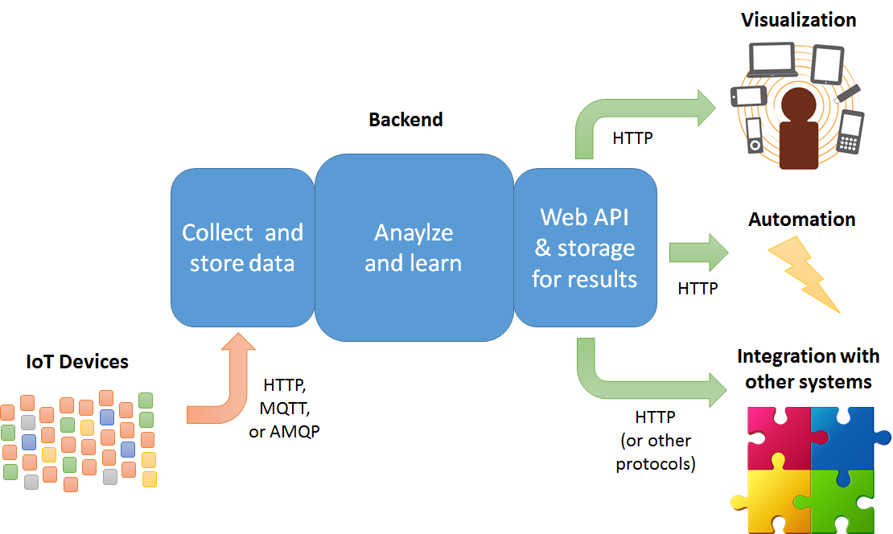
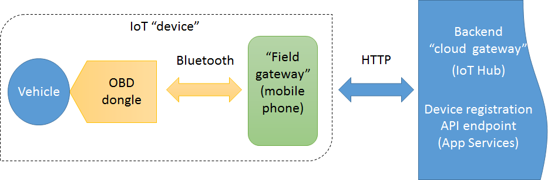
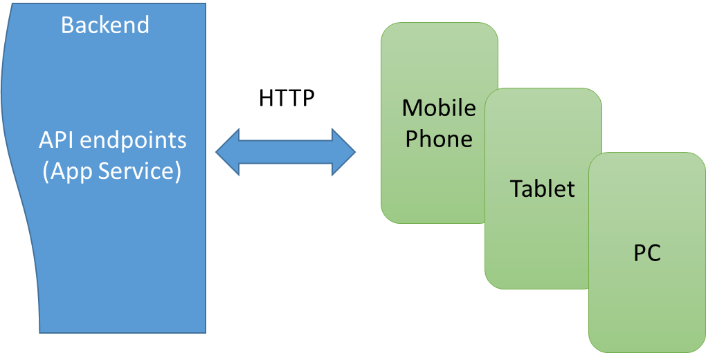

# Main components and relationships: IoT, mobile app, and backend interfaces

As described in the introduction, the design of the overall {Token:ProjectName} system has three primary components:

- IoT devices connected via HTTP to the Azure IoT Hub ("cloud gateway") component of the backend.
- The backend as a whole, which is composed of a number of Azure services.
- Data visualization and consumption through apps on mobile/tablet/PC devices, through automated systems, or through integration with other systems. In general, these consume the backend’s API endpoints or other access to storage.

The IoT devices can be built in a number of ways, with the sole requirement being their ability to communicate with the backend cloud gateway through protocols such as HTTP, MQTT, or AMQP as shown above. In the {Token:ProjectName} demonstration, these “devices,” as outlined in the figure below, are composed of an OBD dongle that’s plugged directly into the vehicle, which talks to a mobile phone via Bluetooth, which in turn sends data to the backend via HTTP:

It’s essential to understand that in this role the mobile phone is simply acting as a “field gateway” to route the IoT data to the backend's cloud gateway (IoT Hub in this case). We chose this model for {Token:ProjectName} because most drivers already have a mobile phone and can acquire an inexpensive off-the-shelf, Bluetooth-capable OBD device to plug into their car. This avoids having to acquire a more expensive dedicated IoT device, which is to say, minimizes the overall cost of the user experience.

In your own scenarios, on the other hand, a mobile device might not be appropriate or assumed, in which case building a dedicated device with a Raspberry Pi could be more cost-effective. Again, it doesn’t matter so long as the “device” here can interact with the cloud gateway via one of its supported protocols. We’ll see all the details in Section 2.1, *IoT devices*.

On the other side of the system, the value derived from the IoT data is delivered through API endpoints in the backend, which includes storage mechanisms that are access through HTTP (and possibly other protocols not shown):

 
How you deliver the user experience is entirely up to you—and in fully automated scenarios might not even involve a user experience. In our demonstration scenario we have two routes for data visualization. First, we’ve chosen Xamarin to deliver apps on iOS, Android, and Windows, through which an user interacts with his or her personal data. Similar experiences could be delivered also through a web browser or other cross-platform app technologies like Apache Cordova and ReactNative. The second route is data visualization *across* users and devices, which is accomplished through PowerBI and its ability to connect to backend data stores directly.  

As mentioned earlier, configuration of the mobile phone as a field gateway on the IoT side happens through the same app that delivers the user experience. This is again a decision made for convenience: the two roles are entirely separate and can be fulfilled by different components if appropriate.

In any case, Section 2.2, *Consuming and visualizing personal data*, explores the Xamarin app used in {Token:ProjectName} including its structure, main flows, how we build it using Visual Studio Team Services, and how we handle distribution and telemetry using HockeyApp.

This brings us to the middle of the system where we have the whole cloud backend running in Microsoft Azure. We'll deal with most of the internal details in section 3, including visualization with PowerBI because that has a more intimate connection with the backend. What we'll concern ourselves with here is rather the backend's external interfaces--namely IoT Hub and API endpoints implemented in Azure App Service.  We’ll see how those are put together in Section 2.3, *Backend interfaces*.
