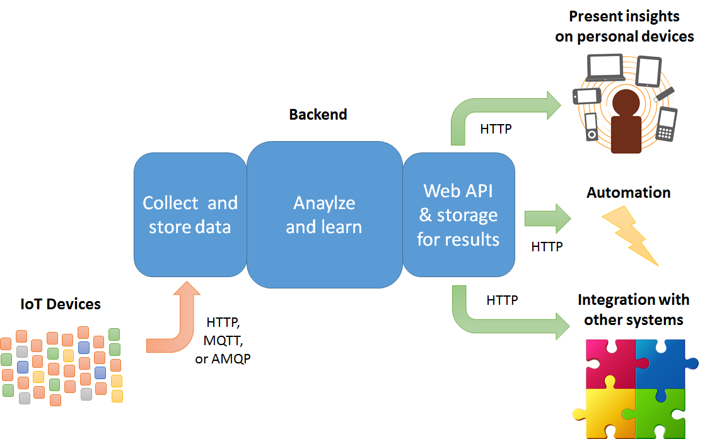
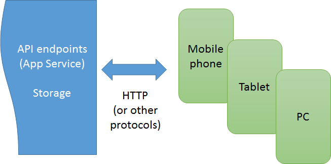

# Main components and relationships: IoT, mobile app, and backend interfaces

As described in the introduction, the design of the overall {Token:ProjectName} system has three primary components:

- IoT devices connected via HTTP to the Azure IoT Hub component of the backend.
- The backend as a whole, which is composed of a number of Azure services.
- Mobile devices, tablets, and/or PCs running apps connected via HTTP to the backend’s API endpoints.

The IoT devices can be built in a number of ways, with the sole requirement being their ability to communicate with the backend’s IoT Hub through HTTP as shown above. In the {Token:ProjectName} demonstration, these “devices,” as outlined in the figure below, are composed of an OBD dongle that’s plugged directly into the vehicle, which talks to a mobile phone via Bluetooth, which in turn sends data onto the backend via HTTP:

It’s essential to understand here that the mobile phone is simply acting as a “field gateway” to route the IoT data to the backend's "cloud gateway." We chose this model in the demonstration scenario because most consumers already have a mobile phone and can acquire an inexpensive off-the-shelf, Bluetooth-capable OBD device to plug into their car. This minimizes the cost of that particular user experience.

In your own scenarios, on the other hand, a mobile device might not be appropriate or would raise the cost of the overall solution, whereas using building a dedicated device with a Raspberry Pi would be much better. Again, it doesn’t matter so long as the “device” here can interact with the cloud gateway (e.g. Azure IoT Hub) via one of its supported protocols. We’ll see all the details in Section 2.1, *IoT devices*.

On the other side of the system, the value derived from the IoT data is delivered through API endpoints in the backend:

 
How you deliver the user experience is entirely up to you—and in fully automated scenarios might not even involve a user experience. In our demonstration scenario we’ve chosen Xamarin to deliver apps on iOS, Android, and Windows, but you can just as easily use a web browser, Apache Cordova, ReactNative, Unity 3D or other immersive graphics/gaming engine, and so on.

As mentioned in the Introduction, configuration of the mobile phone as a field gateway on the IoT side happens through the same app that delivers the user experience. This is again a decision made for convenience: the two roles are entirely separate and can be fulfilled by different components if appropriate.

In any case, Section 2.2, *Consuming and visualizing the data*, explores the Xamarin app used in {Token:ProjectName} including its structure, main flows, how we build it using Visual Studio Team Services, and how we handle distribution and telemetry using HockeyApp.

This brings us to the middle of the system where we have the whole cloud backend running in Microsoft Azure, the internal details of which we’ll see in Section 3. Here we'll first concern ourselves with its interfaces to the other components, namely IoT Hub and the backend’s API endpoints that are implemented with Azure App Service. As you can see in the diagrams above, there are APIs on both ends: one API to provision/register IoT devices with the IoT Hub, and then a number of APIs that deliver the results to whatever user experiences you might want to build around them. We’ll see how all this is put together in Section 2.3, *Backend interfaces*.
