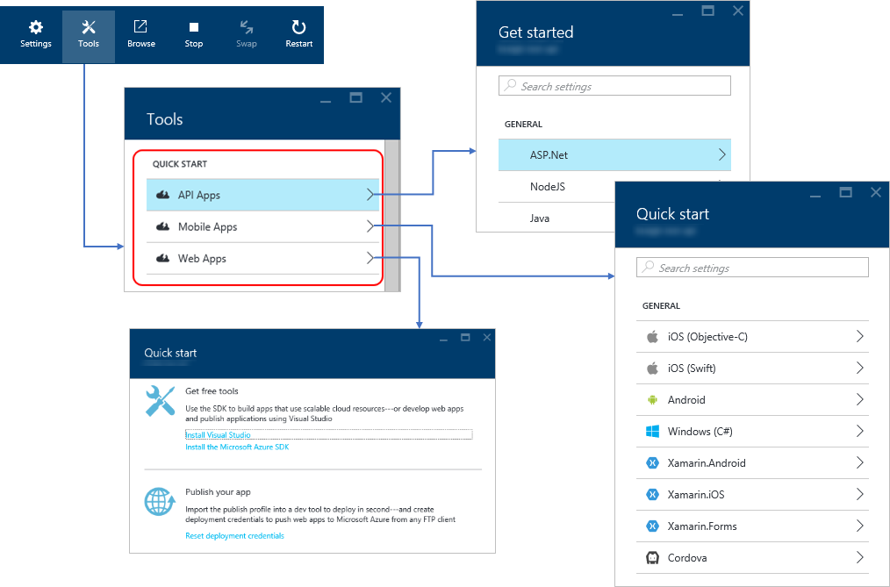

# Primer: Azure App Service for mobile backends

The best mobile apps—those that best engage consumers and thus perform well for their publishers—are consistently those that have great backends to power the experience. Many apps, for example, clearly rely on data retrieved from a backend, which could be collecting and processing information from a variety of other sources. In fact, it’s often helpful to think of apps as customizing a mobile device to be a viewport onto the backend. Even games often use backend services to manage leaderboards and to alert players to new challenges.

A backend in the cloud is also, by nature, independent of mobile platforms, meaning that apps running on iOS, Android, and Windows can all use that same backend. When combined with cross-platform app technologies like Xamarin and Apache Cordova, a large portion of your total application—backend and clients together—share common code. What’s more, you can update your backend code any time without going through specific app store submissions, and thus the more functionality you put in the backend, the less you have to deploy to the individual mobile platforms.

Across the whole gamut of cloud-connected mobile apps, there has emerged a core set of backend capabilities that many apps require:

- **Push notifications** let the backend send messages to any number of devices, independent of specific mobile platform. Push notifications can be broadcast generally or targeted to an individual user’s devices.
- **Offline-capable storage** easily shares data between the mobile app and the backend without going through messaging protocols, and automatically handles local caching and synchronization as mobile apps experience varied connectivity. Data can be segmented on a per-user or per-app basis, and the backend can attach scripts to operations like insert, update, and delete. This way the backend can detect when one user or client updates information in the table and send push notifications to other users or clients.
- **Identity** provides (ideally) enterprise-grade authentication and per-user identity through mechanisms like Azure Active Directory and OAuth providers like Microsoft, Google, Facebook, and Twitter. A unique identify for every user allows the backend to send user-specific push notifications, and to store and manage per-user data even when a user works with the same app on multiple devices.

<illustration?>

Building on this, many mobile apps also need a couple of other capabilities:

- **Background jobs** do continuous and/or scheduled processing in the always-on and always-connected backend, commonly used to retrieve, process, and cache data from other services so it’s immediately available to the mobile app. By centralizing such processing in the backend, you minimize power and data usage on the mobile devices and avoid having to deal with sporadic mobile connectivity. Collecting data in the backend can also minimize the number of requests to other services that might impose their own usage limits.
- **Custom API endpoints** supply routes for mobile apps to invoke operations in the backend that aren’t otherwise covered by the other capabilities. Oftentimes these are used to run more complex queries against the backend data rather than having the mobile app search through storage directly.
 
<illustration?>

Going still further, it’s often the case that you have both mobile and web experiences connected to the same backend—especially for shared data—and for enterprise apps especially you might need to connect to on-premises resources and tie into other business processes.

<complete illustration>

The question, then, is how to build up a backend with such capabilities that will also easily scale up and down with customer demand. It’s certainly possible, of course, to build all these from scratch inside virtual machines, but like many developers you’re probably much more interested in delivering great user experiences to your mobile customers than you are in building and maintaining custom infrastructure.

**Azure App Service**

Recognizing this, Microsoft has packaged these features together as the Platform-as-a-Service (PaaS) offering called [Azure App Service](https://azure.microsoft.com/en-us/documentation/articles/app-service-value-prop-what-is/), which you can [use for free](https://azure.microsoft.com/en-us/pricing/details/app-service/) until you’re ready to ramp up toward production and then scale out from there.

Azure App Service is basically a container for a variety of features that you can turn on individually by configuring them in the Azure portal.

<table>
<tr>
	<td><strong>Feature</strong></td>
	<td><strong>Location in Azure UI</strong></td>
	<td><strong>Description</strong></td>
</tr>
<tr>
	<td><strong>Identity</strong></td>
	<td>Settings > Features > Authentication / Authorization</td>
	<td>Authentication via Microsoft, Google, Facebook, Twitter, or Azure Active Directory, and authorization to control access to backend features.</td>
</tr>
<tr>
	<td><strong>Offline storage & sync</strong></td>
	<td>Settings > Mobile > Easy tables</td>
	<td>Using Azure SQL databases or table storage, the app works with the storage through in-memory objects, which the Azure libraries you include with the app take care of all the HTTP requests to the backend to keep the local and cloud copies in sync. Offline changes in the app are automatically cached and synced when connectivity is restored.</td>
</tr>
<tr>
	<td><strong>Push notifications</strong></td>
	<td>Settings > Mobile > Push</td>
	<td>Send notifications easily to iOS, Android, and Windows devices through the notification hub, which scales to millions of devices.</td>	
</tr>
<tr>
	<td><strong>APIs</strong></td>
<td>Settings > Mobile > Easy APIs Settings > API > API definition</td>
	<td>The Easy APIs feature creates the necessary infrastructure (C# or Node.js) to expose and manage API endpoints, leaving you to focus on the core API implementation. You can also set the URL of a Swagger 2.0 metadata file (JSON) to make you API discoverable.</td>
</tr>
<tr>
	<td><strong>Web Jobs</strong></td>
	<td>Settings > Web Jobs > Webjobs</td>
	<td>Upload code files that will run as background tasks in the App Service, or you can run them manually through the portal.</td>
</tr>
<tr>
	<td><strong>Web Apps</strong></td><td>Settings > General > Properties Settings > General > Application settings</td>
	<td>When creating an app service, you get a public URL along with FTP deployment endpoints, allowing you to set up whatever structure you need for your web app. In some cases Azure will deploy a Node.js structure for you automatically, or provide you with an ASP.NET structure that you can quickly deploy through Visual Studio.</td>
</tr>
</table>

It must be pointed out that as App Service has evolved, its features have been grouped together and presented in different ways, but with just a few exceptions they’re all part of the same whole. At present, for example, the portal shows four apparently distinct “app types”: Web, Mobile, API, and Logic. The first three—Web, Mobile, and API—are all the same thing and all use the same configuration UI in the portal. The best way to streamline configuration of each part is to go to the **Tools** blade and select one of the **Quick Start** options:
 

As you can see, the quick starts for API Apps let you choose from ASP.NET, Node.js, and Java; Mobile Apps gives you starter code for both native and cross-platform mobile clients; and Web Apps gives you guidance on starting a project in Visual Studio that you can deploy to App Service to stand up a web site.

The **Logic Apps** type within App Service, though, stands apart and has its own UI through which you create integrations between different services. This is done through “managed APIs“ or “connectors” and a visual designer. For details, refer to [What are Logic Apps?](https://azure.microsoft.com/en-us/documentation/articles/app-service-logic-what-are-logic-apps/) in the Azure documentation.

> **Did you know?** Azure App Service is the next-generation Azure product that combines the capabilities of older products such as Azure Websites and Azure Mobile Services, among others. Although Mobile Services is still supported, but Microsoft recommends that new projects begin with Azure App Service because it gives you all the features of Mobile Services, web apps, and API apps in the same place.

**Best Practices**

When working with Azure App Service, you’ll find that an App Service must be assigned to what’s called a *Plan* or a pricing tier. The Plan is just a simple name for the type of virtual machine in which you’re running the app service, and the VM determines the pricing.

The Plan or virtual machine is not limited, however, to a single App Service instance: you can create multiple such instances within the same Plan, meaning that they share the resources of the one virtual machine. This is helpful when you want to use different technologies for different backend purposes. 

Serving up a web application and handling API requests all depend on a running HTTP server that handles incoming requests. If you’ve configured features like Easy Tables or Easy API with ASP.NET, then the web application should be based on ASP.NET. If you’ve chosen Node.js, then other web application components within the same App Service must be compatible with Node.js. Otherwise you’ll see “Unsupported service” messages appear in the Azure UI.

If you run into these sorts of issues, you can simply create another App Service instance within the same Plan and configure it to use a different technology. This way you can have your website, for example, implemented with ASP.NET, but use Node.js for your API. A Logic App, in fact, is always created within its own App Service instance, but can run on the same Plan as other instances.

The most common need between such instances is the ability to share data. Fortunately, Azure SQL databases and Azure table storage operate independently of App Service instance. This means that you can have any number of instances running in any number of Plans all share the same database, which is perhaps also accessed by other Azure components in your overall solution.

In the <TOKEN: project name> reference implementation, we can see this at work. The centralized Azure SQL database  as shown in Figure <TODO> is shared across the App Service instance that implements the APIs, the Stream Analytics that processes data from the IoT Hub, and the Machine Learning instance. As you extend the reference architecture in your own projects, you can of course make use of this same central store for other needs.
