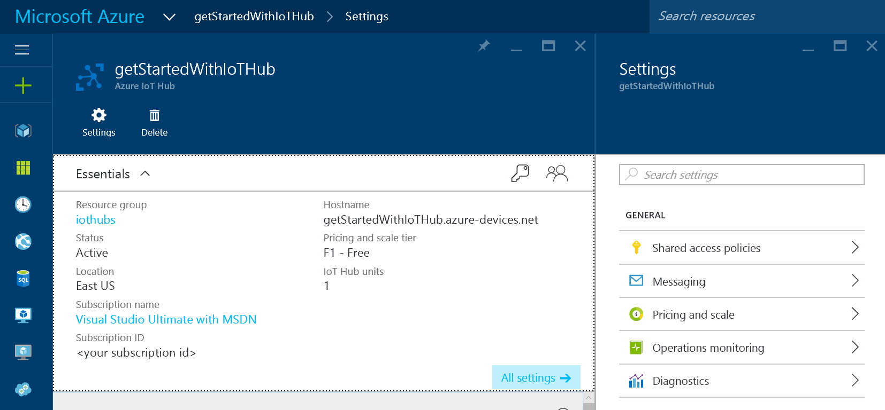
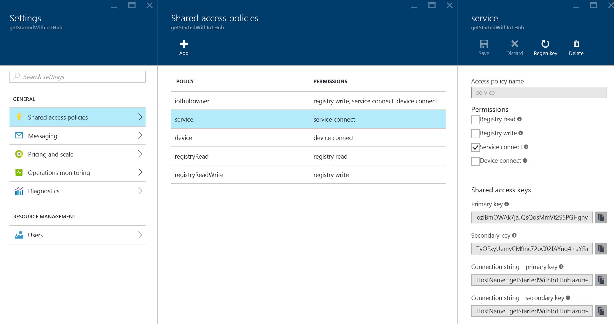
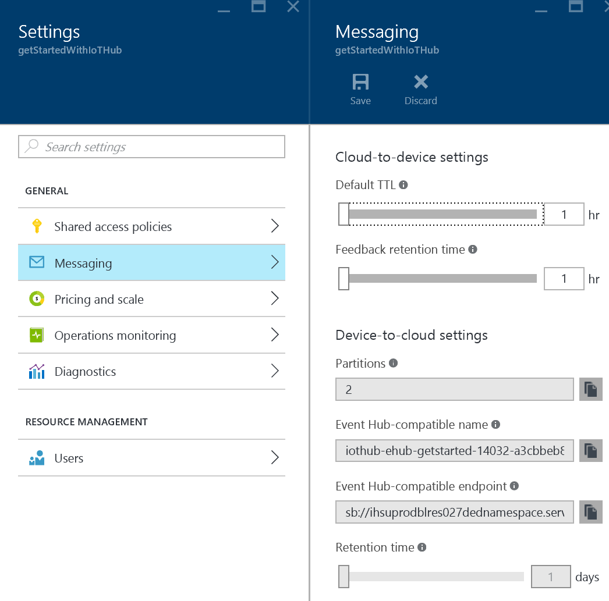
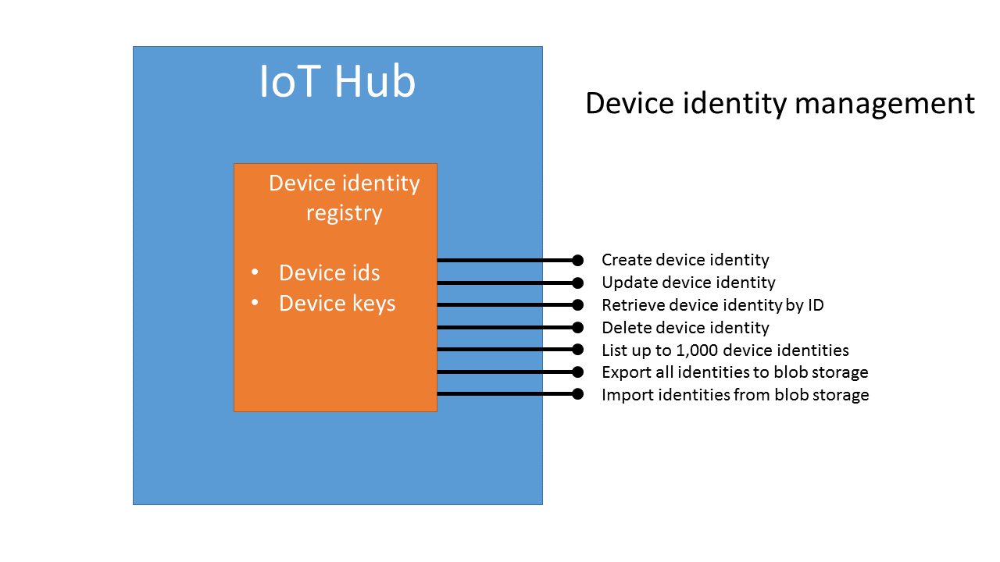

# IoT Hub


This section describes how the [TODO:appname] uses the Azure IoT Hub service to enable telemetry ingress to the cloud. This is the starting point for the flow of data through the cloud-hosted solution back end in the [TODO:appname] system.

You'll learn about the role of IoT Hub in the architecture and see how we implemented this functionality in the [TODO:appname] solution.

In this section:

- Primer on IoT Hub
- The role of IoT Hub in the [TODO:appname] solution
- Configure and manage IoT Hub
- Provision devices
- Retrieve device messages from IoT Hub

## Primer

### What is IoT Hub?


[Azure IoT Hub][lnk-iot-hub] is a fully managed service that enables reliable and secure bidirectional communications between millions of IoT devices and a solution back end. Azure IoT Hub:

- Provides reliable device-to-cloud and cloud-to-device messaging at scale.
- Enables secure communications using per-device security credentials and access control.
- Provides monitoring for device connectivity and device identity management events.
- Includes device libraries for the most popular languages and platforms.

#### Reliable device-to-cloud and cloud-to-device messaging at scale

IoT Hub can reliably receive hundreds of thousands of messages per second from your devices and retains the message data for up to seven days to guarantee reliable processing by your solution back end and to absorb peaks in the load. The solution back end can use IoT Hub to send messages with an at-least-once delivery guarantee to individual devices.

Azure IoT Hub scales to millions of simultaneously connected devices and millions of messages per second.

#### Secure communications

You can provision each device with its own security key to enable it to connect to IoT Hub. The IoT Hub *identity registry* in your IoT hub stores the device identities and keys for your solution. A custom solution back end can whitelist and blacklist individual devices by enabling or disabling them in the identity registry.

#### Monitoring

You can receive detailed operation logs about device identity management operations and device connectivity events. This enables your IoT solution to easily identify connectivity issues, such as devices that try to connect with wrong credentials, send messages too frequently, or reject all cloud-to-device messages sent to them.

#### Device libraries

[Azure IoT device SDKs][lnk-iot-sdks] are available and supported for a variety of languages and platforms. There is a C library for many Linux distributions, Windows, and real-time operating systems. There are also SDKs for managed languages, such as C#, Java, and JavaScript.

> Note: The C library is designed specifically to simplify porting it to other platforms.

#### IoT Hub endpoints

IoT Hub exposes several endpoints that enable devices and other cloud-based services to interact with the service:


Each IoT Hub exposes two device facing endpoints you can access using the HTTP, AMQP, or MQTT protocols:

- *Send device-to-cloud telemetry*. A device can connect to this endpoint to send messages to the solution back end. In this solution, phone (acting as a field gateway) connects to this endpoint using the [TODO] protocol to forward the data from the OBD device.
- *Receive cloud-to-device commands*. A device can connect to this endpoint to retrieve any messages sent to the device by the solution back end. IoT Hub maintains a separate queue for each device to deliver these cloud-to-device messages. The solution does not use this endpoint.

Each IoT Hub exposes three service endpoints you can access using the AMQP protocol:

- *Receive device-to-cloud telemetry*. A back-end service can connect to this endpoint to retrieve any messages sent to the hub from a device. This endpoint is compatible with [Azure Event Hubs][lnk-event-hubs] and you can connect to it using any of the interfaces and SDKs that support Event Hubs. In this solution, the Azure Stream Analytics service can connect directly to this endpoint because **Event Hub** is a valid **Source Type** for a Stream Analytics job.
- *Send cloud-to-device commands and receive delivery acknowledgments*. These two endpoints enable your solution back end to send reliable cloud-to-device messages, and to receive the corresponding delivery or expiration acknowledgments. The solution does not use these endpoints.

In addition to the message oriented endpoints, IoT Hub also exposes these endpoints:

- *Device identity management*. You can use this HTTP REST endpoint to manage the device identity registry in your IoT hub. You can create, retrieve, update, and delete the device identities that the solution uses for device authentication and access control.
- *Hub monitoring*. You can use this Event Hub-compatible endpoint to collect monitoring data from your IoT hub about device identity operations, device-to-cloud communications, cloud-to-device communications, and connections to the hub.
- *Resource provider*. The IoT Hub resource provider exposes an [Azure Resource Manager][lnk-arm] interface that enables Azure subscription owners to create IoT hubs, update IoT hub properties, delete IoT hubs, and perform bulk device identity import and export operations. The script you can use to deploy this solution to your own Azure subscription makes use of this endpoint. The device provisioning component in this solution uses these endpoints to register new devices.


### IoT Hub security and the service-assisted communication pattern

Azure IoT Hub works well with the [service-assisted communication][lnk-service-assisted-pattern] pattern which describes how to mediate the interactions between your IoT devices and your solution back end. The goal of service-assisted communication is to establish trustworthy, bidirectional communication paths between a control system, such as IoT Hub, and special-purpose devices that are deployed in untrusted physical space. The pattern establishes the following principles:

- Security takes precedence over all other capabilities.
- Devices do not accept unsolicited network information. A device establishes all connections and routes in an outbound-only fashion. For a device to receive a command from the back end, the device must regularly initiate a connection to check for any pending commands to process.
- Devices should only connect to or establish routes to well-known services, such as IoT Hub, they are peered with, such as IoT Hub.
- The communication path between device and service or between device and gateway is secured at the application protocol layer.
- System-level authorization and authentication are based on per-device identities. They make access credentials and permissions nearly instantly revocable.
- Bidirectional communication for devices that connect sporadically due to power or connectivity concerns is facilitated by holding commands and device notifications in until a device connects to receive them. IoT Hub maintains device specific queues for the commands it sends. This may introduce latency to command handling because the device does not act on the command until the device connects to the queue and retrieves the command.

The mobile industry has successfully used the service-assisted communication pattern at enormous scale to implement push notification services such as [Windows Push Notification Services][lnk-wns], [Google Cloud Messaging][lnk-google-messaging], and [Apple Push Notification Service][lnk-apple-push].

In the current solution, the phone acts as a field gateway and does not listen on any port for incoming connections from IoT Hub. The phone itself establishes an outbound connection to the device-to-cloud messaging endpoint on the hub to send telemetry.

## Decision point: why did we chose IoT Hub?

IoT Hub performs three roles in this solution:

- It reliably receives telemetry collected by the OBD devices in multiple vehicles into the cloud infrastructure.
- It makes the telemetry data available to other cloud services for storage and processing.
- It ensures that only known, registered devices can connect to and communicate with the cloud-based infrastructure.

There are two Azure services that enable telemetry ingress to the cloud at scale: [IoT Hub][lnk-iot-hub] and [Event Hubs][lnk-event-hubs]. The article [Comparison of IoT Hub and Event Hubs][lnk-comparison] offers a detailed comparison of these services and their intended use cases, but for the [TODO:appname] solution, the key reasons for selecting IoT Hub over Event Hubs are:

- *Security*: IoT Hub provides per-device identity and revocable access control. Every device that connects to IoT Hub has a unique identity and must be registered in the IoT device identity registry before in can connect to the hub. This guarantees that the source of every message that IoT Hub receives is known. It also means that the access granted to a specific device can be revoked at any time. Event Hubs uses shared access policies to grant access so if your solution requires per-device credentials, you must implement this functionality yourself. Shared access policies also offer only limited revocation support.
- *Operations monitoring*: IoT Hub enables monitoring through a rich set of device identity management and connectivity events such as individual device authentication errors, throttling, and bad format exceptions. These events enable you to quickly identify connectivity problems at the individual device level. Event Hubs offers only aggregate metrics.
- *Device SDKs*: IoT Hub provides device SDKs for a range of languages and platforms making it easier to build custom OBD devices that can connect directly to IoT Hub with no need for a field gateway.

## How do I set up an IoT hub?

There are two main ways to create an IoT Hub service instance in your Azure subscription. You can sign in to the portal and configure an IoT hub manually, or you can use an Azure Resource Manager (ARM) template along with a script to add the IoT hub. When you deploy the [TODO:appname] solution, the scripts make use of an ARM template to automate the creation  of the hub.

### Create an IoT hub through the portal

The article [Manage IoT hubs through the Azure portal][lnk-manage-iot-hubs-portal] describes how you can add a new IoT hub to your subscription through the Azure [portal][lnk-azure-portal]. When you have created your IoT hub you can use the portal to view and edit your IoT hub settings from the **Settings** blade:



On the **Shared access policies** blade you can view the defined access policies and access the **Shared access keys** and **Connection strings** you use to connect to the hub. For example, in this solution the device registration component uses the **registryReadWrite** policy when it connects to the hub:



On the **Messaging blade** you can edit the settings that affect how your IoT hub receives and stores messages. You can also access the Event Hub-compatible name and endpoint values you need to connect to the hub to retrieve messages sent from devices. In this solution, the Azure Stream Analytics uses these values to connect to the hub:



The **Pricing and scale** blade enables you to move to different tiers when you need to scale your hub up or down. The section [How do I scale my IoT hub?](#scaling) describes this in more detail.

The **Operations monitoring** blade enables you to select the monitoring categories and provides you with details of the endpoint where you can retrieve the monitoring data.

The **Diagnostics** blade enables you to toggle diagnostics data for the hub. This diagnostics data is displayed in the portal.

### Use an ARM template to create an IoT hub

You can use the portal to create and configure an IoT hub. However, if you are creating an IoT hub as part of a larger solution that uses other Azure resources it is usually more convenient to use a script to create your resources using Azure Resource Manager (ARM) templates. The set up of this solution uses ARM templates to create and configure multiple Azure services including IoT Hub. The following snippet from the scenario_complete.json template in the DeploymentScripts\ARM folder defines the IoT hub in the solution:

```
{
  "$schema": "https://schema.management.azure.com/schemas/2015-01-01/deploymentTemplate.json",
  "contentVersion": "1.0.0.0",
  "parameters": {
    "iotHubSku": {
      "type": "object",
      "defaultValue": { "name": "Free", "tier": "F1", "capacity": 1 }, 
      "allowedValues": [
        { "name": "Free", "tier": "F1", "capacity": 1 },
        { "name": "Standard", "tier": "S1", "capacity": 1 },
        { "name": "Standard", "tier": "S2", "capacity": 1 }
      ]
    },
  ...
  },
  "variables": {
    "baseName": "CarTelemetry",
    ...
    /* IoT Hub settings */
    "iotHubName": "[concat(variables('baseName'), 'IoTHub', '-', uniquestring(resourceGroup().id))]",
    "iotHubKeyName": "iothubowner",
    ...
  },
  "resources": [
  ...
    /* Create IoT Hub */
    {
      "apiVersion": "2016-02-03",
      "type": "Microsoft.Devices/IotHubs",
      "name": "[variables('iotHubName')]",
      "location": "[resourceGroup().location]",
      "sku": "[parameters('iotHubSku')]",
      "properties": { }
    },
  ...
  ],
  "outputs": {
  }
}
```

This template creates an IoT hub in the same region as the containing resource group. Notice how the template expects the name of the hub to be defined as a variable within the template and the SKU to use to be passed in as parameter.

To learn more about ARM templates in general or how to deploy an IoT Hub specifically, see:

- [Azure Resource Manager overview][lnk-arm]
- [Create an IoT hub using Powershell][lnk-arm-powershell]

## How do I provision devices?



To provision a device you need to complete two steps:

1. Create an entry for the device in the device identity registry in your IoT hub. Registering a device creates a unique identity in the registry with an associated key that the device can use to authenticate with the hub.
2. Install the device key on the device to enable the device to connect to your IoT hub.

At a high level, the device identity registry is a REST-capable collection of device identity resources. The following sections detail the device identity resource properties, and the operations the registry enables on the identities. The service libraries in the [Microsoft Azure IoT SDKs][lnk-iot-sdks] GitHub repository enable easy access to the device identity registry using C#, Java, or Node.js.

The IoT Hub device identity registry exposes the following operations:

* Create device identity
* Update device identity
* Retrieve device identity by ID
* Delete device identity
* List up to 1,000 identities
* Export all identities to blob storage
* Import identities from blob storage

### Registering a device in the [TODO:appname] solution

In the [TODO:appname] solution, a phone can self-register with the solution's IoT hub by invoking an Azure App Service endpoint. The phone app must first authenticate with the App Service back end, and then it can call the **DeviceProvision** endpoint to request a key that grants it access to the IoT hub device-side endpoints.

The **ProvisionController** class in the **MobileApp** solution adds an entry to the IoT hub identity registry using **deviceName** provided by the phone app and returns the generated authentication key to the phone:

```
public async Task<IHttpActionResult> Post(string userId, string deviceName)
{
    Device device;
    ...

    var existingDevices = await GetDevices();
    int maxDevices = int.Parse(settings["MaxDevices"]);
    smarttripsContext context = new smarttripsContext();
    var curUser = context.UserProfiles.Where(user => user.UserId == userId).FirstOrDefault();

    if (curUser == null)
    {
        curUser = context.UserProfiles.Add(new MyTrips.DataObjects.UserProfile { Id = Guid.NewGuid().ToString(), UserId = userId });
    }

    if (curUser.Devices == null)
    {
        curUser.Devices = new List<string>();
    }

    if (curUser.Devices.Count >= maxDevices)
    {
        return BadRequest("You already have more than the maximum number of devices");
    }
    
    try
    {
        device = await registryManager.AddDeviceAsync(new Device(deviceName));
        curUser.Devices.Add(deviceName);
        await context.SaveChangesAsync();
    }
    catch (DeviceAlreadyExistsException)
    {
        device = await registryManager.GetDeviceAsync(deviceName);
    }
    return Created("api/provision", device.Authentication.SymmetricKey.PrimaryKey);
}
```

Notice how the code in the **Post** method above also makes use of a separate store holding user profile data. An IoT solution typically has a separate solution-specific store that contains application-specific metadata. You should only use the device identity registry for device management and provisioning operations. High throughput operations at run time should not depend on performing operations in the device identity registry.

In the phone app, the **DeviceProvisionHandler** class in the **MyTrips.AzureClient (Portable)** project invokes the method shown above to retrieve the device's connection string for accessing IoT hub.

You can learn more about the device identity registry in IoT Hub in the "Device identity registry" section of the [Azure IoT Hub developer guide][lnk-devguide-registry].

## How do I manage my devices?

<a name="scaling"/>
## How do I scale my IoT hub?

IoT Hub is available to deploy in one of three tiers:

| F1 Free | S1 Standard | S2 Standard |
| ------- | ----------- | ----------- |
| 8,000 messages/unit/day | 400,000 messages/unit/day | 6,000,000 messages/unit/day |
| 1 unit | Up to 200 units | Up to 200 units |

You should use the F1 tier for testing and development. It is not possible to transition an F1 tier instance to either of the paid tiers.

The S1 and S2 tiers are for production workloads and you can transition a hub at any time between the two paid tiers based on your expected message volumes. You can also adjust the number of IoT Hub units (up to the maximum of 200) in these tiers at any time.

You can find out more in [Scaling IoT Hub][lnk-scaling] and [IoT Hub quotas and throttling][lnk-quotas].

When you create an IoT hub, you can also specify the number of partitions (between 2 and 32, default 4) to create. The number of partitions you create does not affect the throughput of the IoT hub but are related to the degree of downstream parallelism required in the application that consumes device-to-cloud messages from the IoT hub's Event Hubs-compatible endpoint. In this solution the consumer of device-to-cloud messages from the IoT hub is Azure Stream Analytics.

## How do I read messages from my devices?

IoT Hub recieves messages at scale from authorized devices. It adds a time stamp and the unique device id of the originating device to the message's metadata when it receives a message before making the message available for any downstream processing. The messages are made available through an Event Hub-compatible endpoint so you can use any of the techniques available for retrieving messages from an Event hub to retrieve messages from your IoT hub.

> Note: You don't need to deploy an Event hub to read messages sent to an IoT hub.

Common ways to retrieve messages from the Event Hub-compatible endpoint in IoT Hub include:

- Azure Stream Analytics (ASA). ASA can use an Event Hub-compatible endpoint as one of its inputs, enabling you to configure an ASA job that reads device messages directly from your IoT hub.
- Using the **EventProcessorHost** NuGet package as described in the [How to process IoT Hub device-to-cloud messages][lnk-d2c-tutorial] tutorial.

The [TODO:appname] solution uses the ASA approach and you can find out more in the section "Azure Stream Analytics" later in this document. The following snippet from the scenario_complete.json ARM template in the DeploymentScripts\ARM folder shows how the ASA input connection to IoT Hub is configured using the IoT Hub shared access policy created when the ARM template provisioned the IoT hub:

```
...
{
"apiVersion": "2015-09-01",
"type": "Microsoft.StreamAnalytics/StreamingJobs",
"name": "[variables('streamingJobName')]",
"location": "[resourceGroup().location]",
"properties": { 
/* The only supported value for ASA sku is standard https://msdn.microsoft.com/en-us/library/azure/dn834994.aspx */
"sku": { "name": "Standard" },
"inputs": [
    {
    "name": "IoTHubSource",
    "properties": {
        "type": "stream",
        "serialization": {
        "type": "JSON",
        "properties": { "encoding": "UTF8" }
        },
        "datasource": {
        "type": "Microsoft.Devices/IotHubs",
        "properties": {
            "iotHubNamespace": "[variables('iotHubName')]",
            "sharedAccessPolicyName": "[variables('iotHubKeyName')]",
            "sharedAccessPolicyKey": "[listKeys(resourceId('Microsoft.Devices/IotHubs/Iothubkeys', variables('iotHubName'), variables('iotHubKeyName')), '2016-02-03')].primaryKey"
        }
        }
    }
    }
],
...
```

## How do I send commands to my devices?

## Troubleshooting
Monitoring and metrics

[lnk-service-assisted-pattern]: http://blogs.msdn.com/b/clemensv/archive/2014/02/10/service-assisted-communication-for-connected-devices.aspx "Service Assisted Communication, blog post by Clemens Vasters"
[lnk-wns]: https://msdn.microsoft.com/library/windows/apps/mt187203.aspx
[lnk-google-messaging]: https://developers.google.com/cloud-messaging/
[lnk-apple-push]: https://developer.apple.com/library/ios/documentation/NetworkingInternet/Conceptual/RemoteNotificationsPG/Chapters/ApplePushService.html#//apple_ref/doc/uid/TP40008194-CH100-SW9
[lnk-event-hubs]: http://azure.microsoft.com/documentation/services/event-hubs/
[lnk-arm]: https://azure.microsoft.com/documentation/articles/resource-group-overview/
[lnk-iot-hub]: http://azure.microsoft.com/documentation/services/iot-hub/
[lnk-iot-sdks]: https://github.com/Azure/azure-iot-sdks
[lnk-comparison]: https://azure.microsoft.com/documentation/articles/iot-hub-compare-event-hubs/
[lnk-manage-iot-hubs-portal]: https://azure.microsoft.com/documentation/articles/iot-hub-manage-through-portal/
[lnk-azure-portal]: http://portal.azure.com
[lnk-arm-powershell]: https://azure.microsoft.com/documentation/articles/iot-hub-rm-template-powershell/
[lnk-scaling]: https://azure.microsoft.com/documentation/articles/iot-hub-scaling/
[lnk-quotas]: https://azure.microsoft.com/documentation/articles/iot-hub-devguide/#throttling
[lnk-devguide-registry]: https://azure.microsoft.com/documentation/articles/iot-hub-devguide/
[lnk-d2c-tutorial]: https://azure.microsoft.com/documentation/articles/iot-hub-csharp-csharp-process-d2c/