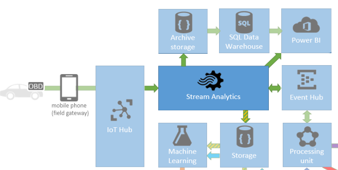
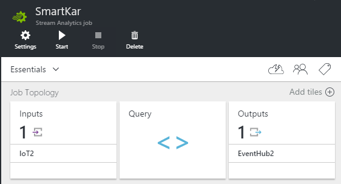

# Primer

## What does Stream Analytics do?

[Azure Stream Analytics](https://azure.microsoft.com/documentation/articles/stream-analytics-introduction/) performs hot-path processing of data streaming from anywhere - devices, sensors, and the web. You use a SQL-like language to express the real-time data transformation. You can filter, join, aggregate, and transform data. Results are continuously passed on to the sinks you specify. Like other Azure services, it's hugely scaleable, secure and reliable.

In our demo, we use Stream Analytics to process data received from ODB devices and cell phones connected through IoT Hub. The task of Stream Analytics is to reshape the data to an actionable form. 



Streaming architectures contrast sharply with a more traditional approach in which incoming data is loaded immediately into a database, which is then queried by user apps. Updating the database is cumbersome, and it can be minutes before a the critical queries can be performed on the uploaded data.

In a streaming solution, the 'hot path' includes pipeline processing of the critical queries. The results are passed straight on to the output apps. At the same time, they can be stored in a database for later examination in a more traditional way.

In our demo, Stream Analytics is the key pipeline for the major data paths:

* A hot path which takes raw data from the OBD devices and mobile phones, filters and aggregates it according to a suitable set of queries in Stream Analytics, and then passes it straight on to the mobile app. 
* The results are also put into storage for processing by Machine Learning.
* A cold path that moves data into archive storage, where it can be inspected at leisure with the help of Power BI.
* Another hot path direct to Power BI, through which we can monitor our service in real time.


## Connecting up Stream Analytics

Stream Analytics is very simple: it has some inputs, some processing code written like SQL queries, and some outputs. Here's what a Stream Analytics job looks like in the Azure portal:



The inputs and outputs are other Azure services. To plug them into Stream Analytics, you just add a new input or output definition, and then copy across the relevant keys and IDs.

Inputs can be sourced from:

* **IoT Hubs**, which gather data from external devices. In our demo app, that's how we get data from the devices.
* **Event Hubs** can also be used as Stream Analytics outputs, so they work well as buffers between multiple Stream Analytics jobs.
* **Blob Storage.** Typically used to join relatively static or 'cold path' data into Stream Analytics queries.

Outputs sink to:

* **Blob storage,** where it can be picked up for presentation by mobile app backend. This is the main hot path of our app. It's also picked up from here by Machine Learning. 

* We also use blob storage as a 'cold path' archive from which we can use Power BI to search and inspect historical data. 

    It's also possible to send data to [Document DB](https://azure.microsoft.com/documentation/services/documentdb/) and [SQL database](https://azure.microsoft.com/documentation/services/sql-database/).


* [Power BI](https://azure.microsoft.com/documentation/articles/stream-analytics-power-bi-dashboard/) which we use to get continuous real-time monitoring of our service.
* **Event Hub,** which acts as a buffer to the processing unit where we can code data flow extensions. [Service Bus](https://azure.microsoft.com/documentation/services/service-bus/) Queues and Topics can also be used as buffers to other processes.

The third piece of a Stream Analytics job is the Query: the code that transforms the inputs into the outputs.

## Queries in Stream Analytics

[Stream Analytics queries](https://msdn.microsoft.com/library/azure/dn834998.aspx) look superficially like conventional SQL queries, but there are some important differences. In particular:

* A query has INPUT and OUTPUT clauses, which select among the connections you have set up. A query can have more than one of each.
* A Stream Analytics job runs continuously until you stop it, and its queries are running continuously in parallel.
* Nevertheless, there's a Test function that allows you to run a query over a finite input table.
* No schema is required. Stream Analytics works with whatever it finds in the inputs.
* The query language has some constructs concerned with timing. For example, there's a LAG expression that compares the current record with previous ones.
* There's no equivalent of aggregating over a whole database, but you can aggregate over arbitrary periods of time - for example, to compute an average over the past ten  minutes or n records. 


This query passes records straight from an input stream to an output:

```

    SELECT *
    INTO OutputStream1
	INPUT InputStream1
```

Use the Test feature to run the query over a test file (here's [a sample](https://raw.githubusercontent.com/Azure/azure-stream-analytics/master/Samples/GettingStarted/HelloWorldASA-InputStream.json)). 

Try these experiments:

#### Filter

Add a WHERE clause:

```

     SELECT *
     INTO OutputStream1
   	 INPUT InputStream1
     WHERE dspl='sensorA'
```

#### Rename and project fields

```

    SELECT 
      time,
      dspl AS SensorName
      temp AS Temperature
     INTO OutputStream1
   	 INPUT InputStream1
     WHERE dspl='sensorA'
```

#### Moving average

    SELECT
      System.Timestamp AS OutputTime,
      dspl AS SensorName,
      Avg(temp) AS AvgTemp
    INTO
      OutputStream1
    FROM
      InputStream1 TIMESTAMP By time
    GROUP BY TumblingWindow(second, 60), dspl
 

* `TIMESTAMP` identifies the `time` field as the time over which to perform the tumbling window average.
* `TumblingWindow` groups the records into successive intervals of the given period.


#### Self-join

This query creates two aliases `t1` and `t2` for a single input stream, and performs a join between the two. Where there is a record from a particular sensor that is not matched by another record within 60 seconds, the query generates an output row.

    SELECT
      t1.time,
      t1.dspl AS SensorName
    INTO
      output
    FROM
      InputStream1 t1 TIMESTAMP BY time
    LEFT OUTER JOIN
      InputStream1 t2 TIMESTAMP BY time
    ON
      t1.dspl=t2.dspl AND
      DATEDIFF(second, t1, t2) BETWEEN 1 and 60
    WHERE t2.dspl IS NULL

The query therefore generates an output when no data has been received from a previously live sensor for the past minute.

#### More examples

[Find more query examples here](https://azure.microsoft.com/documentation/articles/stream-analytics-stream-analytics-query-patterns/).


## Where should Stream Analytics be used?

### Why Stream Analytics is used in this solution


### Where Stream Analytics is applicable


## Best practices for Stream Analytics


## Scaling


