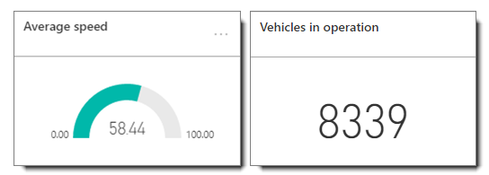

# Role in the architecture

For the {Token:ProjectName} architecture, Power BI serves as a presentation and data analysis layer in both the streaming data hot path, described in this section, and the cold path for archived data, described in section 3.2.4.

## Power BI role in the hot path

Streaming data from the {TODO:SA JOBNAME} Stream Analytics job PowerBISink output is received into a Power BI dataset for the Power BI user account specified in the output. This dataset then serves as the basis for creating reports containing visualizations. Visualizations are then _pinned_ to dashboards as tiles. Individual tiles or entire dashboards can then be shared with other Power BI users in the organization or embedded in custom apps, Web pages, or blogs.

Let’s look at each component in more detail.

_**PowerBISink output**_

The PowerBISink output configured for the {TODO:SA JOBNAME} Stream Analytics job requires an authorized connection to an existing Power BI user account. Once authorized, the output alias (PowerBISink), dataset name, and table name are configured in the Power BI settings.

_**Power BI user account**_

A Power BI user account must be specified for a Stream Analytics output that pushes data to Power BI. The dataset will be created for this account and appear in that user’s workspace navigation pane. The dataset is not explicitly available to other users in the organization; however, the account owner can share the dataset through a content pack, or create dashboards that can then be shared to other Power BI users in the organization.

_**Dataset**_

A dataset is automatically created when a Stream Analytics output job to Power BI is first run. The dataset contains a schema, defined by the output query (table, fields), as well as the latest values for each data point in the output. Streaming data into the dataset is first-in first-out; that is, each data point is retained in the dataset only for as long until it is replaced by a new value.

In our demo, data from the PowerBISink output is pushed to the MyDriving-ASADataset Power BI dataset. MyDriving-ASADataset contains a single table, TripPointData, and fields defined in the output query. It's from this dataset where we begin exploring the data in it by creating reports with visualizations. To do that, we simply click on the MyDriving-ASADataset in the workspace navigation pane.  

_**Report**_

In Power BI, one or more reports can be created for a dataset. Each report can contain one or more pages, and each page can contain one or more visualizations. To begin creating a report,  click on the dataset. Report editor opens with a blank canvas.

In the Report editor, the **TripPointData** table and the following fields appear in the Fields pane:
- TripId
- UserId
- EngineLoad
- ShortTermFuelBank1
- LongTermFuelBank1
- EngineRPM,
- Speed
- MAFFlowRate
- ThrottlePosition
- TripRuntime
- DistancewithMIL
- RelativeThrottlePosition
- OutsideTemperature
- EngineFuelRate
- latitude
- longitude
- TimeStamp (rounded to 5 sec interval)
- POIType (Whether Hard Acceleration or Hard Brake)

To create a visualization, click on a field or drag a field onto the report canvas. A default visualization  is created, but can be changed by selecting a different visualization type from the Visualizations pane.

Power BI has more than two dozen native visualizations. Not all visualization types work with any type of data. With streaming data, it’s important to choose a visualization type that provides a quick, intuitive view of constantly changing data. For example, a donut chart visualization will not effectively display a single, changing value; however, A gauge chart will show that value in a format that easily shows the change, just as a speedometer shows the speed you are driving.

Filters can be applied to an individual visualization or to all visualizations on a report page. Visualizations can then be pinned to one or more dashboards. Visualizations on dashboards are known as tiles. When a user clicks on a pinned tile in a dashboard, the underlying report opens in the browser.

_**Dashboard**_

A dashboard can combine views of data from multiple sources in a single pane, providing a consolidated view across the organization regardless of where the data lives. Each metric, or insight, is displayed on the dashboard as a tile.

Dashboards can be shared with other Power BI users in the organization. Those users can then customize their own copy of the dashboard.
