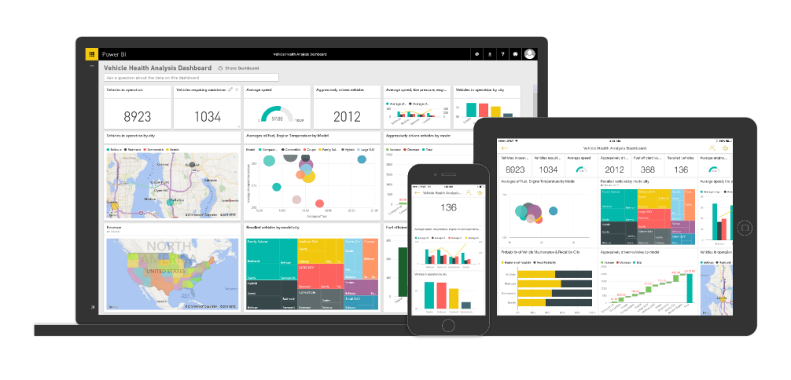

# Role in the architecture

## Visualize data with Power BI

Microsoft [Power BI](https://powerbi.microsoft.com/en-us/documentation/powerbi-desktop-getting-started/) is a cloud-based business intelligence and analytics service connecting users to a broad range of data through live streaming dashboards, highly interactive reports, and intuitive sharing and collaboration on any device.

Power BI includes:

#### Power BI service
* Live dashboards support real-time streaming data
* Drill through to underlying reports
* Natural language query with Q&A—ask questions of your data more naturally
* Cortana integration—allows you to access your data from Windows 10
* Quick insights—auto discover patterns and insights in your data
* Easily connect to multiple data sources bringing disparate data sources together
* Native apps for iPad, iPhone, Android and Windows devices
* Embed fully interactive visuals in custom apps, Web pages, and blogs

#### Power BI Desktop
* Free, downloadable desktop application
* Connect to any data
* Advanced data query, shaping, and modeling
* Custom metrics with Data Analysis Expressions (DAX)
* Intuitive drag-and-drop report creation
* Quick and easy publishing to the Power BI service

#### Power BI developer
* Azure Stream Analytics for real-time data streaming
* Power BI REST API for real-time data streaming
* Custom visualizations support through the open source visualization framework
