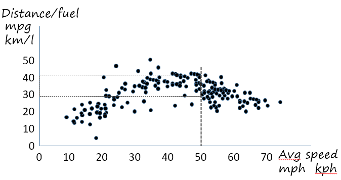
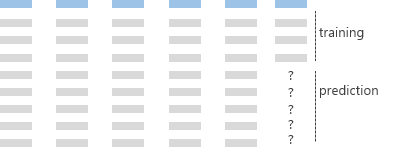
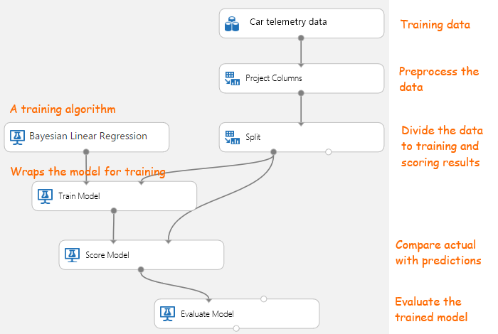
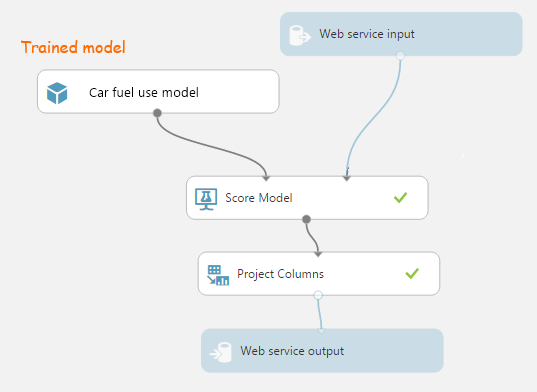

# Primer

## Machine Learning

This solution uses machine learning (ML) to predict fuel usage from a variety of factors such as speed and driving style gathered from the ODB device in the car. 

The role of machine learning (ML) is to predict values of a variable such as fuel cost from known data such as driving speed, acceleration, car model, and so on. As part of the development of the app, we train an ML model on data where the resulting costs are known. The trained model is then used in the deployed app to predict those costs from new data. As the model is used, the actual results can be used to periodically re-train the model. The more data gathered, the more accurate it will be.

We use Azure ML Studio to train the model and develop the data processing required to massage its inputs into a suitable form. Then the trained model is made available as a web service that accepts new data points and returns predicted costs. 

### How does machine learning work?

Machine learning works by identifying clusters in data points. Let's say we plot a graph with measured fuel use against the average speed for each trip. The resulting chart won't look quite like the manufacturers' published figures. There's a spread of data points because many factors influence the actual fuel use on any particular trip.

The graph is just a way of presenting a table with two columns (fuel and speed), each row representing a trip. We feed this table into the machine learning service in training mode. 

Then we take the trained model and switch to prediction mode. We give it some more figures, this time with one column missing: given my average speed is 50, what's my fuel use likely to be? Based on the cluster of points near speed=50, the model comes back with a prediction of 35. Based on the breadth of the cluster, it also provides an error estimate of plus or minus 5. 

Now let's add more columns for car model, average acceleration, air temperature, and more. We could also add color of car, whether the air conditioning is switched on, the size of the driver's hat, and whatever other variables we can think up and practicably collect. With so many dimensions, the data is now more difficult to envision on a chart, but the ML's task is still to identify clusters in this hyper-dimensional space, and predict one variable given the others.

### Development decisions in ML

While we're developing the machine learning component of our application, there are a number of important decisions to be made.

## Developing Machine Learning in Azure

To get started, create a new Machine Learning workspace in Azure (or open ours - there's a link in the getting started pack). The workspace contains a number of sample *experiments.* They open in ML Studio, a tool that runs in your browser.

The main window is a graphical designer for an experiment. You can pull a variety of *modules* off the toolbox, and connect them up graphically. 

One of the modules is your source sample data, which you can import from a variety of formats such as CSV. Because we're in training mode, this the historical data that we've collected, with all the columns complete. 

### Training the model

The first task is to train a model, then run it and evaluate the results. The Split module divides some of the sample data to training, and some of it to use to query the model to see what it predicts. The Scoring module runs the trained model, generating a table with both actual and predicted versions of the fuel column. The Evaluation module analyses this result to summarize the accuracy of the predictions.

The training phase is not just about clustering the data; it's about designing the experiment for good results. 

The main choices during training are made to some extent by trial and error:

* **Choice of input data.** It might turn out that the size of the driver's hat has little effect on the fuel cost. Data points are distributed evenly over the hat-size axis, so that the model can make no useful prediction based on it. So we exclude that column. On the other hand, it might occur to us at this stage that we should collect some data more likely to be useful, such as altitude and humidity.
* **Choose the training algorithm** from the gallery. Different algorithms are designed for different types of input and output, and for different objectives - such as anomaly detection or classification. Each algorithm has a number of parameters that can be tweaked.
* **Shape the input data** by appropriate preprocessing, for example by selecting different columns, computing new columns, or by aggregation. The toolbox includes a variety of preprocessing modules. You can also code up your own, using the R language.

For the driving demo, we already completed the first training phase. However, as more data is collected, the model can be re-trained to improve its accuracy. 

### Predictive mode

To use the model, right-click the Train Model module and choose Save as Trained Model. Then create a Predictive Experiment, with a somewhat simpler structure:

The parts for training have gone, but the Score Model module (which uses the model to generate predictions) is still there. We use Project Columns to drop the input columns that we don't need. The input and output are now a web service. These modules provide us with a REST API that can be used to query the model.

